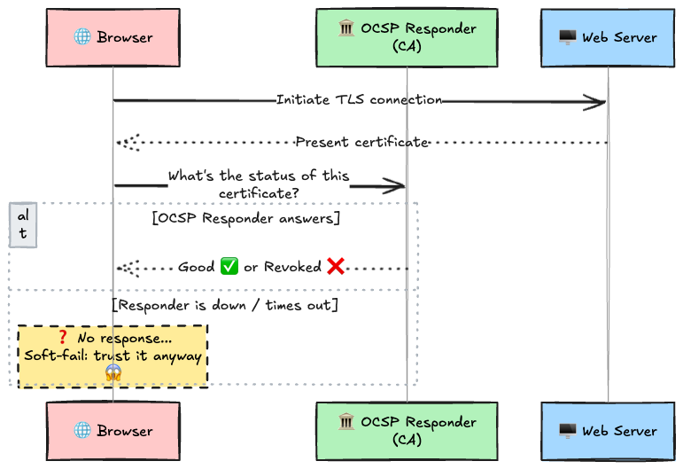
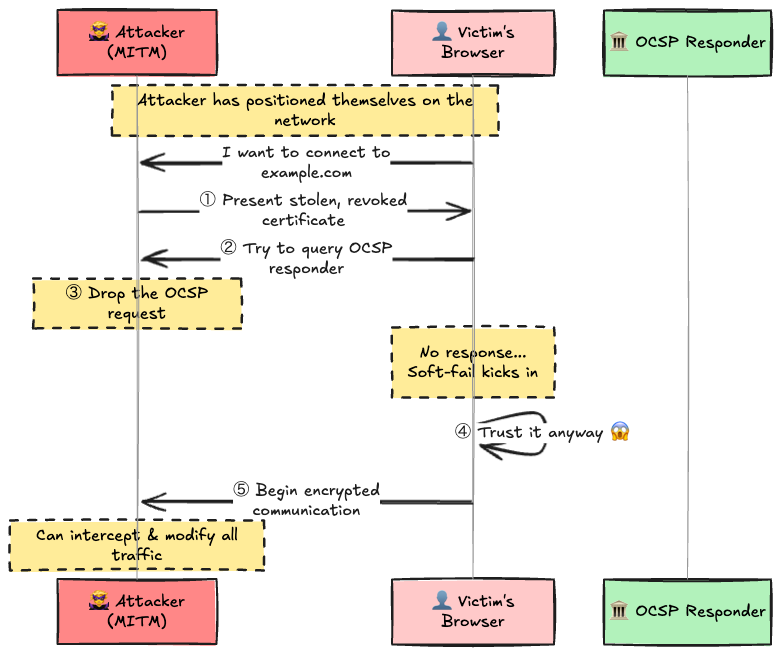
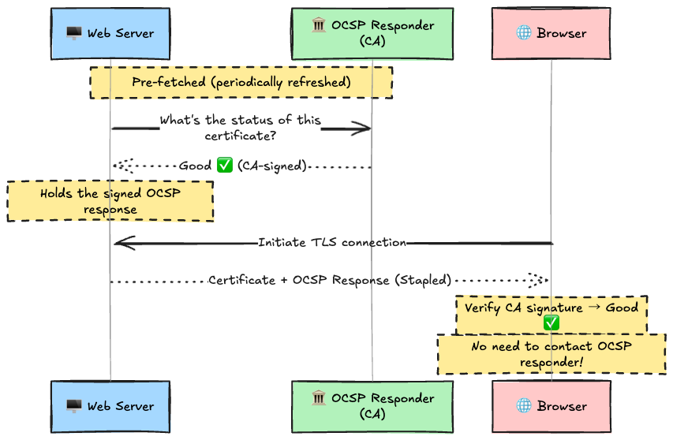
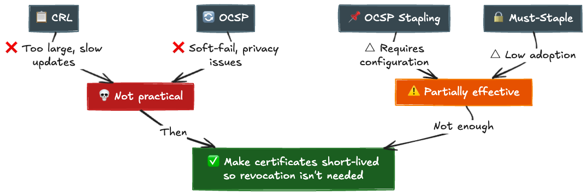
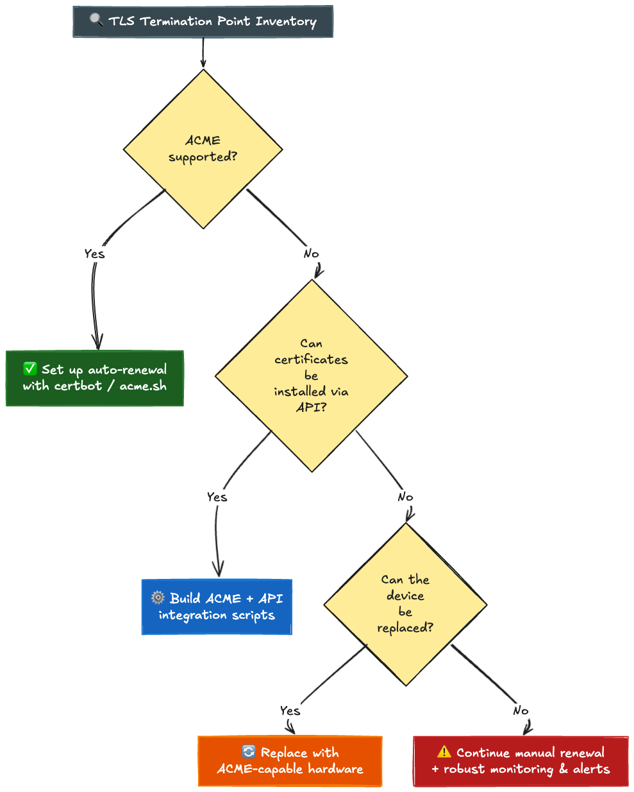
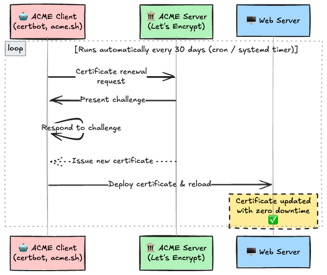

# Introduction

The other day, I was casually scrolling through my server's certificate renewal logs when something caught my eye.

"...Wait, this renewed again? Didn't it just do that?"

Let's Encrypt certificate renewals hit every 90 days. Since I've automated the process, I don't usually think about it—but looking at the logs, certbot was running practically every month. And then it hit me. Just a few years ago, certificate lifetimes were **1 year**. Go further back, and they were **3 years**. Why did they get so short?

Down the rabbit hole I went, and the story was far deeper than I expected.

In April 2025, the CA/Browser Forum unanimously passed **Ballot SC-081v3**. Here's what it says:

> **By March 2029, the maximum validity period for SSL/TLS certificates will be reduced to 47 days.**

47 days. For anyone who remembers buying "3-year certificates," this sounds absurd. But behind this decision lies a fatal problem that Web PKI has carried for years: **certificate revocation is structurally broken.**

The first half of this article explains *why* certificates need to be shorter. The second half covers *what that means for us* as engineers.

---

## 1. What Even Is a "Certificate Validity Period"?

Before we can talk about shortening lifetimes, we need to understand what the validity period actually does.

An SSL/TLS certificate has two fields: `Not Before` (start date) and `Not After` (end date). You can check them with `openssl`:

```bash
echo | openssl s_client -connect example.com:443 2>/dev/null | openssl x509 -noout -dates
# notBefore=Jan 30 00:00:00 2025 GMT
# notAfter=Mar 1 23:59:59 2026 GMT
```

The span between `notBefore` and `notAfter` is the "validity period." Browsers categorically refuse to trust certificates outside this window.

**So why does a validity period exist in the first place?**

Certificate trust depends on the private key. Because the server holds the private key, it can prove it's the legitimate owner of that certificate. But what if the private key leaks? An attacker can impersonate the legitimate server using that certificate.

The validity period is the **last line of defense** against private key compromise. Even if nobody notices the leak, the certificate automatically becomes worthless once it expires.

In other words: **validity period = the maximum window an attacker can exploit a compromised key.** The shorter it is, the smaller the blast radius.

---

## 2. The History of Validity Periods: 10 Years → 47 Days

Certificate maximum validity has been shrinking consistently since the 2000s. Understanding this history makes it clear that the current trend isn't a sudden policy shift—it's the **continuation of a 20-year trajectory**.

| Period       | Max Validity       | Trigger                                                                |
| :----------- | :----------------- | :--------------------------------------------------------------------- |
| ~2011        | **8–10 years**     | Early SSL era. Long-lived certificates were the norm                   |
| 2012         | **5 years (60m)**  | CA/Browser Forum establishes Baseline Requirements                     |
| 2015         | **3 years (39m)**  | Baseline Requirements amendment                                        |
| Mar 2018     | **2 years (825d)** | Ballot 193                                                             |
| **Sep 2020** | **1 year (398d)**  | **Apple unilaterally enforced in Safari. Google and Mozilla followed** |
| Mar 2026     | **200 days**       | SC-081v3 Phase 1 (※ we are here now)                                   |
| Mar 2027     | **100 days**       | SC-081v3 Phase 2                                                       |
| **Mar 2029** | **47 days**        | **SC-081v3 Phase 3 (final target)**                                    |

The 2020 event deserves extra context. A vote within the CA/Browser Forum failed to reach consensus, yet **Apple unilaterally announced that Safari would refuse to trust any certificate with a validity exceeding 398 days.** Google and Mozilla followed suit, making it a de facto industry standard.

This revealed the power dynamics of Web PKI in stark terms. No matter how many long-lived certificates a CA issues, **if the browsers say "we don't trust it," that's the end of the discussion.** A certificate that Safari, Chrome, and Firefox reject is effectively useless on the internet.

---

## 3. Revocation Is Broken — The Real Reason Behind Shorter Lifetimes

Here's the core of this article.

"If a private key leaks, can't you just revoke the certificate immediately? Why bother shortening the validity period itself?"

Fair question. But here's the thing: the "just revoke it" mechanism **barely works in practice.** This is the single biggest reason certificate lifetimes are being pushed shorter.

Let's walk through it.

### 3.1 What Is Revocation?

First, the basics.

Certificate revocation means **a CA (Certificate Authority) declares that a still-valid certificate should no longer be trusted.** This is used when a private key is compromised, domain ownership transfers, or a certificate was mis-issued—situations where trust needs to be withdrawn before the natural expiration date.

The problem is: how do you communicate this "declaration" to clients (browsers)? Historically, two mechanisms were built for this: CRL and OCSP.

### 3.2 The Problem with CRL (Certificate Revocation Lists)

CRL is the oldest revocation-checking mechanism. The CA periodically publishes a file containing serial numbers of all revoked certificates, and browsers download it to cross-check.

Sounds simple enough, but it has three fatal flaws:

1. **The file gets enormous.** When a major CA revokes a large number of certificates, the CRL can balloon to tens of megabytes. Downloading this every time a user visits an HTTPS site is wildly impractical
2. **Update frequency is low.** A CRL specifies a "Next Update" date, and the stale list is cached until then. Any certificates revoked in the interim are not reflected
3. **If the CA's infrastructure goes down, you can't fetch it.** If the CRL Distribution Point (CDP) is overloaded or experiencing an outage, revocation checking becomes flat-out impossible

### 3.3 The Problem with OCSP (Online Certificate Status Protocol)

If CRL is "downloading the entire phone book," OCSP is "calling to ask about one number at a time." The browser queries the CA's OCSP responder in real time for each individual certificate: "Is this certificate still valid?"



Looks better than CRL, but this is where Web PKI's **most critical design flaw** lives. Look at the "else" branch above.

### 3.4 Soft-fail: Revocation Fails Exactly When You Need It Most

What happens when the browser can't reach the OCSP responder?

**Nearly every browser chooses to "trust it anyway" (soft-fail).**

Why? If browsers hard-failed (refused the connection when OCSP is unreachable), **a single outage on a CA's OCSP server would make every website issued by that CA inaccessible worldwide.** You couldn't even reach a hotel Wi-Fi captive portal to log in. That user experience is unacceptable, so browser vendors chose soft-fail.

But soft-fail is **trivially exploitable by attackers.**



Consider a MITM (Man-in-the-Middle) attack scenario:

1. The attacker uses a **leaked private key** to present a **revoked certificate** to the victim
2. The victim's browser attempts to verify revocation status via OCSP
3. **The attacker controls the network and blocks the OCSP request**
4. The browser gets no response—soft-fail triggers, and it "trusts it anyway"
5. The attacker maintains the impersonation using a revoked certificate, intercepting and modifying traffic at will

**Revocation checking fails precisely in the scenario where it's needed most—when you're under attack.** This is a design-level contradiction. It looks like a seat belt, but it's actually a harness that's not attached to anything.

### 3.5 OCSP Stapling — A Partial Fix

**OCSP Stapling** was created to address this. Instead of the browser reaching out to the CA, the **web server itself** pre-fetches a CA-signed OCSP response and delivers it to the client during the TLS handshake, bundled with the certificate.



This eliminates the attacker's ability to block OCSP requests. It also sidesteps the privacy issue of browsers leaking browsing history to the CA.

**Must-Staple**, a certificate extension, takes this further by instructing the browser: "Reject the connection if OCSP Stapling is not present."

However, **Must-Staple adoption is extremely low.** If a server operator fails to fetch the OCSP response, even a legitimate site becomes inaccessible. Most sites don't take that risk.

### 3.6 Browser Vendors' Response: "We Gave Up on Revocation Checking"

Faced with these problems, major browsers went their own way.

| Browser     | Approach    | Description                                                                                                                    |
| :---------- | :---------- | :----------------------------------------------------------------------------------------------------------------------------- |
| **Chrome**  | **CRLSets** | Google curates a high-risk revocation list bundled with and pushed to the browser. Real-time OCSP was **discontinued in 2012** |
| **Firefox** | **CRLite**  | A Bloom filter–based compressed revocation database distributed to the browser. Covers all certificates                        |
| **Safari**  | OCSP-based  | Routes through Apple's proprietary OCSP proxy. Privacy concerns remain                                                         |

Chrome dropped real-time OCSP checks entirely in 2012. In Adam Langley's words (then Chrome's security engineer), OCSP was **"a seat belt that looks like it works but isn't actually attached to anything."**

### 3.7 So the Only Option Is to Make Them Shorter



If revocation is broken, just **build a world that doesn't rely on revocation.**

Make certificate lifetimes short enough that even if a private key is compromised, the certificate naturally dies within days to weeks. It doesn't matter if OCSP is broken. The certificate expires on its own.

**This is the essence of short-lived certificates.** It's not "shortening them because it's convenient." It's "shortening them because revocation is broken and there's no other viable path."

---

## 4. CA/Browser Forum Ballot SC-081v3: The Phased Transition to 47 Days

With the shared understanding that "revocation is broken," the CA/Browser Forum unanimously passed SC-081v3 in April 2025. Apple, Google, Mozilla, Microsoft—all major browser vendors—along with major CAs like DigiCert, Sectigo, and Let's Encrypt signed on.

### 4.1 Phased Transition Schedule

| Effective Date     | Max Certificate Validity | DCV Reuse Period |
| :----------------- | :----------------------- | :--------------- |
| **March 15, 2026** | **200 days**             | **200 days**     |
| **March 15, 2027** | **100 days**             | **100 days**     |
| **March 15, 2029** | **47 days**              | **10 days**      |

### 4.2 What Is DCV and Why Is It Being Shortened Too?

**DCV (Domain Control Validation)** is the process by which a CA verifies that the applicant actually owns or controls the domain they're requesting a certificate for. In Let's Encrypt's ACME protocol, this corresponds to HTTP-01 challenges (proving you can place a file at a specific path) or DNS-01 challenges (proving you can add a TXT record to DNS).

Currently, once DCV succeeds, the result can be reused for up to 398 days—meaning certificates can be renewed without re-validation during that window.

SC-081v3 **shortens the DCV reuse period to 10 days by 2029.** Why? If domain ownership changes, stale DCV results could allow a certificate to be issued for the *previous* owner. The shorter the DCV reuse period, the more accurately it reflects current ownership.

In practice, this means **every certificate renewal will effectively require re-proving domain ownership.**

### 4.3 Why Specifically 47 Days?

The number 47 originated from Apple's initial proposal (45 days) and was finalized after discussion within the CA/Browser Forum.

No official formula has been published, but from an operational standpoint, the number is rational:

| Item                                    | Days     |
| :-------------------------------------- | :------- |
| Certificate validity period             | 47 days  |
| Recommended renewal point (2/3 elapsed) | ~Day 31  |
| Recovery window if renewal fails        | ~16 days |

Renew once a month, and even if it fails a couple of times, you've still got roughly two weeks of recovery cushion.

---

## 5. Let's Encrypt's Foresight: 90 Days, Then 6

Let's Encrypt has been **leading this short-lived revolution ahead of the industry.**

### 5.1 Why Let's Encrypt Started at 90 Days

When Let's Encrypt launched in 2015, the industry standard was 2–3 year certificates. They deliberately chose 90 days, and explained their reasoning in an official blog post ("Why ninety-day lifetimes for certificates?"):

1. **Limiting the damage window from a compromise**: Even if a private key leaks, the certificate automatically becomes invalid after at most 90 days
2. **Forcing automation**: 90 days is too short for comfortable manual management. This effectively made automated renewal via ACME (RFC 8555) a requirement, not an option
3. **Reducing dependence on revocation**: Exactly the problem covered in Section 3. When certificates are short-lived, broken OCSP is far less of an issue

The 90-day choice was strategic. 60 days was too close to manual renewal cycles, causing frequent mishaps. 120 days left room for the "I can still do this manually" mentality. 90 days hit the sweet spot: "painfully tight without automation, but with the recommended 60-day renewal interval, you can run it monthly."

### 5.2 6-Day Certificates Arrive (January 2026)

In January 2026, Let's Encrypt went even further with **6-day (160-hour) certificates**, now generally available.

```bash
# Requesting a 6-day certificate with certbot
certbot certonly --preferred-profile shortlived -d example.com
```

Key points about 6-day certificates:

- Validity period of 160 hours (~6.7 days)
- Requested by **specifying the `shortlived` certificate profile in ACME**
- Also supports certificate issuance for IP addresses (short-lived only)
- Opt-in; coexists with standard 90-day certificates
- **No OCSP response embedding needed.** The certificate dies naturally in 6 days, making revocation checking meaningless

6-day certificates are the current cutting edge of the "world without revocation" described in Section 3.

---

## 6. The Other Goal of Shorter Lifetimes: Preparing for Post-Quantum

The primary driver behind shorter certificate lifetimes is "revocation is broken," but there's another critical context: **Crypto Agility.**

Crypto agility is **the ability to rapidly switch cryptographic algorithms without causing widespread disruption.**

Why does this matter? Current SSL/TLS certificates are signed with RSA or ECDSA, but when practical quantum computers arrive, **both RSA and ECDSA are theoretically broken** (Shor's algorithm efficiently solves large integer factorization and discrete logarithm problems). When that happens, the entire web's certificates will need to migrate to NIST-standardized post-quantum algorithms (ML-KEM, ML-DSA, etc.).

What separates organizations here is their "migration muscle":

| Organization State                | Response During Algorithm Migration                                              |
| :-------------------------------- | :------------------------------------------------------------------------------- |
| **Auto-renewing every 47 days**   | Apply the new algorithm on the next renewal cycle. Full migration in weeks       |
| **Manually renewing once a year** | Manually inventory and replace every certificate. Months-to-years emergency work |

Automating short-lived certificates isn't just about "automating a chore"—it's a **structural hedge against future cryptographic crises.**

---

## 7. Operational Problems Created by Shorter Lifetimes

Up to this point, I've been making the case for *why* shorter lifetimes are necessary. Now let's be honest about the downsides.

### 7.1 The End of Manual Management

With 47-day certificates, you need roughly 8 renewals per year. Humans will absolutely drop the ball at that frequency.

| Validity      | Renewals/Year | Manual Management         |
| :------------ | :------------ | :------------------------ |
| 1 year (398d) | ~1            | Barely manageable         |
| 200 days      | ~2            | Doable                    |
| 100 days      | ~4            | Getting painful           |
| **47 days**   | **~8**        | **Physically impossible** |

ACME (RFC 8555) automation becomes the de facto standard. The tools already exist—certbot, acme.sh, Caddy's automatic HTTPS. The problem is **the environments that haven't adopted them yet.**

### 7.2 Certificate Expiry Outages — Even Microsoft and SoftBank Got Burned

"Forgetting to renew a certificate" happens inevitably when humans are in the loop. This isn't theoretical.

| Year     | Incident                       | Cause                                                                                                          | Impact                                             |
| :------- | :----------------------------- | :------------------------------------------------------------------------------------------------------------- | :------------------------------------------------- |
| **2017** | **Equifax data breach**        | An expired certificate on a network monitoring device caused attack traffic to go **undetected for 10 months** | 150 million individuals' personal data exposed     |
| **2018** | **SoftBank nationwide outage** | An expired certificate embedded in Ericsson's telecom switch software                                          | ~4-hour outage across 11 countries including Japan |
| **2020** | **Microsoft Teams outage**     | Forgotten authentication server certificate renewal                                                            | ~3 hours of worldwide inaccessibility              |

Even Microsoft—one of the largest tech companies on Earth—"forgot to renew a certificate." The SoftBank outage wasn't even their fault: it was an expired certificate embedded in vendor (Ericsson) switch software. When a certificate rots somewhere in the supply chain, everything downstream collapses.

With renewal frequency increasing 8x in the 47-day era, the opportunities for these incidents multiply. **Any system without automation becomes a ticking time bomb.**

### 7.3 Systems That Can't Support ACME

Not every system supports ACME.



The categories that cause the most pain:

- **Hardware load balancers** (F5 BIG-IP, etc.): Many older models don't support ACME. Certificate installation is limited to manual upload via web UI
- **Firewall / VPN appliances**: Entirely dependent on vendor ACME support
- **IoT / embedded devices**: Firmware updates alone can be challenging
- **Legacy systems**: The "pickled" systems you can neither update nor decommission

Manually uploading certificates to these devices every 47 days is, to put it mildly, torture.

### 7.4 DCV Reuse Period Shrinking to 10 Days

As covered in Section 4.2, but worth emphasizing: after 2029, the DCV reuse period drops to 10 days.

If you're using DNS-01 challenges, you'll be rewriting DNS TXT records on every certificate renewal. If your DNS API is unreliable or DNS propagation is slow, the renewal failure risk shoots up. In environments spanning multiple DNS providers, renewal script complexity explodes.

---

## 8. Surviving the Short-Lived Certificate Era

### 8.1 Full ACME Adoption



This is the bare minimum, but it's worth periodically verifying that certbot's auto-renewal is actually working.

```bash
# Check if the systemd timer is active
systemctl status certbot.timer

# Rehearse to see if renewal actually succeeds
certbot renew --dry-run
```

### 8.2 At Scale: Introducing CLM

Once you're managing dozens to hundreds of servers, certbot alone isn't enough. You need a **CLM (Certificate Lifecycle Management)** platform to centrally manage certificates across the organization.

| Capability             | What It Does                                                                   |
| :--------------------- | :----------------------------------------------------------------------------- |
| **Discovery**          | Automatically detect all certificates on the network. Visualize "what's where" |
| **Expiry Monitoring**  | Alert on certificates approaching expiration. Slack / PagerDuty integration    |
| **Auto-renewal**       | Execute automated renewal across ACME-compatible systems in bulk               |
| **Policy Enforcement** | Enforce rules like "RSA 4096+ only" or "no key reuse"                          |
| **Reporting**          | Compliance dashboard. Audit-ready reporting                                    |

---

## 9. Public vs. Private Certificates

One more critical clarification. **SC-081v3 only applies to "publicly trusted" TLS certificates—those issued by CAs in browsers' trust stores.**

| Certificate Type         | SC-081v3 Scope | Examples                                                                                  |
| :----------------------- | :------------- | :---------------------------------------------------------------------------------------- |
| **Public certificates**  | ✅ In scope     | Public-facing websites, external APIs, mail servers                                       |
| **Private certificates** | ❌ Out of scope | Internal PKI-issued certs, inter-service mTLS, IoT device certs, dev/staging environments |

Certificates issued by your organization's private CA can have whatever validity period your policies dictate.

That said, the best practices proven with public certificates—short lifetimes and automation—should be applied to private PKI as well. Workload identity frameworks like SPIFFE/SPIRE default to certificate lifetimes of roughly 1 hour, which sits squarely on this same trajectory.

---

## Conclusion

The reason certificate lifetimes keep shrinking can be summed up in one sentence: **"Because revocation is broken."**

1. **CRL and OCSP are structurally broken.** OCSP's soft-fail, in particular, harbors a fatal contradiction: it stops working precisely when you're under attack—the exact moment revocation checking matters most
2. **CA/Browser Forum SC-081v3 mandates a maximum validity of 47 days by March 2029.** DCV reuse periods are also being cut to 10 days
3. **Let's Encrypt led the charge with 90-day certificates and launched 6-day certificates in 2026**
4. **Shorter lifetimes directly support post-quantum migration readiness (Crypto Agility)**
5. **In the 47-day era, full ACME automation becomes a survival requirement.** Manual management is physically impossible
6. **SC-081v3 only applies to public certificates.** Private PKI can operate under its own policies

Phase 1 (200 days) took effect in March 2026. It's already here. If your organization hasn't adopted automated certificate renewal yet, you'd better start moving before Phase 2 (100 days) arrives in 2027.

---

## References

- [CA/Browser Forum - Ballot SC-081v3](https://cabforum.org/2025/04/07/ballot-sc-081v3-reduce-ssl-tls-certificate-validities/)
- [Let's Encrypt - Why Ninety-Day Lifetimes for Certificates?](https://letsencrypt.org/2015/11/09/why-90-days.html)
- [Let's Encrypt - Short-Lived Certificates (2024/2026)](https://letsencrypt.org/2024/12/04/short-lived-certs/)
- [RFC 8555 - Automatic Certificate Management Environment (ACME)](https://datatracker.ietf.org/doc/html/rfc8555)
- [RFC 6960 - X.509 Internet PKI Online Certificate Status Protocol (OCSP)](https://datatracker.ietf.org/doc/html/rfc6960)
- [Adam Langley - Revocation Checking and Chrome's CRL (2012)](https://www.imperialviolet.org/2012/02/05/crlsets.html)
- [DigiCert - TLS Certificate Validity Changes](https://www.digicert.com/blog/tls-certificate-validity-changes)
