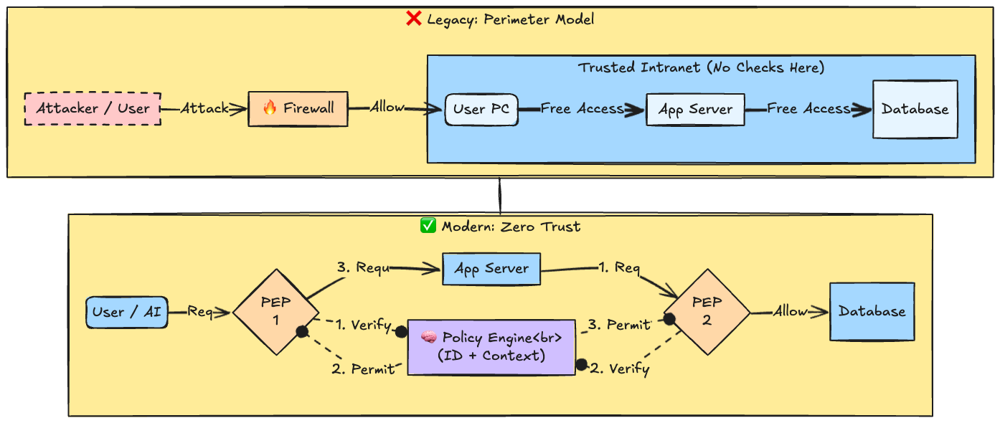
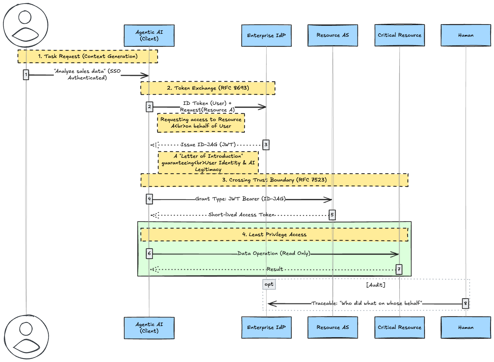
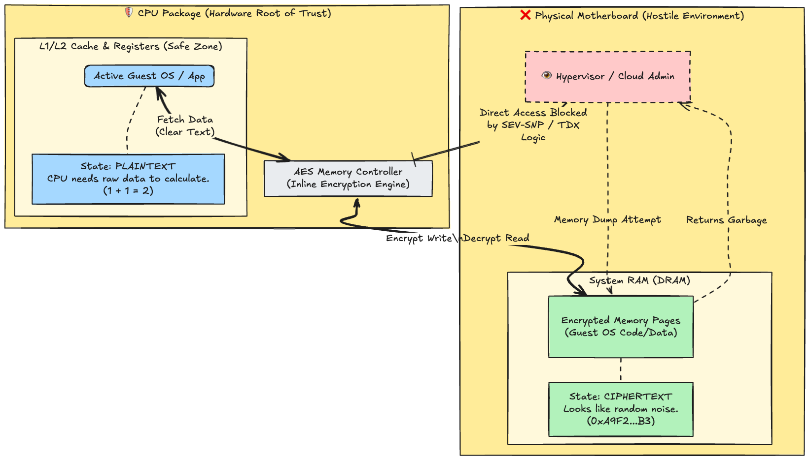
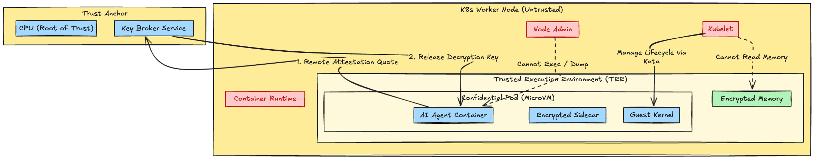

# Introduction

For security engineers, the **"Trust Boundary"** has long been the "red dotted line" drawn on architecture diagrams. Inside the firewall was safe; outside was dangerous. The DMZ was a buffer zone. That idyllic era is long gone.

As of 2026, with the widespread adoption of Cloud-Native technologies and the rise of **Agentic AI (Autonomous AI Agents)**, the concept of this "boundary" has become more granular and dynamic than ever before. There is no longer an "inside." We must assume that every process and every data access occurs within a **Hostile Environment**.

In this article, we redefine the true nature of the modern trust boundary and explain, down to the internal structure, the two core technologies required to defend it: **"ID-JAG" for dynamic authentication** and **"Confidential Computing (CVM/CoCo)" for hardware isolation**.

## 1. The Shift: From Network to Identity

The boundary used to be a "Place" (Network). Now, the "Identity" itself is the boundary.

### Maturity of Zero Trust Architecture (ZTA)

The Zero Trust principle of "Never Trust, Always Verify" is no longer just a slogan; it is the standard for implementation. Every request and every packet is treated as an act of crossing a boundary.

* **Legacy (Castle & Moat):** Once the "City Gate" (Firewall) was breached, lateral movement within the internal network (Intranet) was free because it was a "Trusted Zone."
* **Modern (Micro-Segmentation):** A **PEP (Policy Enforcement Point)** is always placed before applications or databases. The PEP queries the **Policy Engine** (IdP or Context Analysis Platform) for every communication to decide whether to permit access "at this exact moment." No implicit trust exists here.

## 2. Agentic AI Problem: The Divergence of "Authentication" and "Intent"

In this Identity-centric security landscape, the biggest disruptive factor is **Agentic AI**. They are not mere tools; they possess their own IDs, make autonomous decisions, call APIs, and access databases.

### Risks of Non-Human Identity

Traditional API Keys or Client Credentials Flows tended to grant "consistently broad privileges" to AI agents. However, this carries the following risks:

1. **Over-Privilege:** Even for a task that only requires "reading sales data," the AI agent's ID is often granted "Read/Write access to all DBs."
2. **Context Loss:** When an AI calls an API, the information regarding "on whose behalf the instruction was given" (On-Behalf-Of) is often lost.
3. **Behavioral Drift:** Through prompt injection or hallucinations, an AI with a legitimate ID might perform unexpected destructive operations.

## 3. Solution A: ID-JAG (Identity Assertion JWT Authorization Grant)

**ID-JAG** is the emerging standard for controlling AI agents dynamically as "User Agents" rather than "static programs." This is a profile that combines OAuth 2.0 Token Exchange [RFC8693] and JWT Profile [RFC7523].

### Architecture: Just-In-Time & On-Behalf-Of

The AI does not operate on its own authority but follows a flow where it **"borrows the User's ID (Identity Assertion) and exchanges it for temporary access rights."**

* **Identity Assertion:** A signed token (like an ID Token) proving the user is logged in.
* **Token Exchange:** The AI presents this Assertion to the IdP and requests, "I want to access Resource Y as a proxy for User X."
* **ID-JAG (JWT):** A short-lived "Proxy Authority Certificate" issued by the IdP. This is used to obtain an access token for the resource.

Through this mechanism, privileges crossing the Trust Boundary are dynamically generated only "at the necessary moment, with the necessary scope, and within a specific context." The era of "leak a static API key and it's game over" is finished.

## 4. Solution B: Confidential Computing - The Silicon Fortress

Even if the "Entrance (Authentication)" is secured by ID-JAG, when AI performs calculations in the cloud, the data in memory (**Data in Use**) is expanded in plaintext. Vulnerabilities in the host OS or malicious cloud administrators (Insider Threats) pose a risk of stealing sensitive information via memory dumps.

The final line of defense against this is **Confidential Computing**.
This technology physically shifts the **Root of Trust** from software managed by the cloud vendor (Hypervisor) to the **CPU (Silicon)**.

### 4.1 Confidential VM (CVM): A Silicon Vault Protecting "Data in Use"

**Confidential VM (CVM)** is a technology that **"encrypts the memory space at the hardware level during computation, completely hiding it even from cloud administrators (Azure/GCP/AWS)."**

For science and engineering students, it is common knowledge that data is encrypted during communication (HTTPS) and storage (AES). However, a vulnerability has long existed in computer architecture where data becomes **Plaintext** the moment it is loaded into memory for calculation (**Data in Use**). CVM solves this.

#### Why? - Use Cases

Even if you say "I don't want anyone to see it," CVM is overkill for a standard web app. CVM becomes essential in the following scenarios:

1. **AI Model Protection (IP Protection):**
   * You spent millions developing an LLM or inference model. If you run this in the cloud and the memory is dumped, **your model weights could be stolen to create copycat products.**
   * With CVM, the model data in memory is encrypted, so even the cloud provider cannot steal it.
2. **Analysis of Highly Sensitive Data (Privacy Computing):**
   * **Medical data** or **financial asset information**. Regulations (like GDPR) often prohibit making this data "accessible to cloud administrators."
   * CVM can mathematically and physically prove that "admins can only see ciphertext," clearing compliance hurdles for cloud usage.

#### Mechanism: The "Translator" Only the CPU Has

Normally, OSs and apps cannot run unless they exist in plaintext on memory (DRAM). So, how do we run them while keeping memory encrypted?
The answer is to **create a "Plaintext World" only inside the CPU.**

1. **Inside CPU Package (Trusted):** This is the Safe Zone. Within L1/L2 caches and registers, data is calculated in **Plaintext**.
2. **Memory Controller (The Boundary):** A gate sitting between the CPU and memory. It **transparently encrypts/decrypts** all data passing through using a hardware key (AES).
3. **Physical RAM/DRAM (Untrusted):** This is the Danger Zone. Only **Ciphertext (random noise)** resides on the memory.

The OS doesn't realize it is encrypted (because the CPU translates for it automatically). However, observing the physical memory from the outside yields not a single bit of meaningful data.

### 4.2 Confidential Containers (CoCo): Kubernetes Native Isolation

While CVM protects the "Whole VM," **Confidential Containers (CoCo)** isolates at the "Pod (Container)" unit. This is ideal for Kubernetes environments, microservices, and execution platforms for AI Agents.

#### Technical Background: Kata Containers + TEE

CoCo launches Kubernetes Pods using lightweight VM runtimes like **Kata Containers** instead of standard `runc`. These lightweight VMs are then placed inside TEEs (Trusted Execution Environments) like Intel TDX or AMD SEV.

As a result, **the memory inside the Pod becomes completely invisible to neighboring Pods on the same Node, and even to the K8s Administrator (Node Admin).**

#### Benefits and Use Cases of CoCo

* **Granular Isolation at Pod Level:** In a multi-tenant K8s cluster, you can protect only specific sensitive Pods.
* **Decryption of Encrypted Images:** Container images are stored encrypted in the registry. They are only decrypted and deployed after a **Key Broker Service (KBS)** verifies the environment via Attestation inside the TEE. Static data on storage is also protected.

## 5. Remote Attestation: Proof of Trust

Encryption at the hardware level is not enough. A mechanism is needed to verify from the outside: "Is this currently running VM/Pod actually inside a genuine, untampered TEE?" This is **Remote Attestation**.

1. **Quote Generation:** Upon startup, the CVM/CoCo creates a report containing its initial state (hashes of firmware, kernel, etc.) and signs it with a CPU-specific private key. This is called a **Quote**.
2. **Verification:** An external Relying Party (User or Key Broker Service) validates the Quote and checks it against the Intel/AMD certificate chain.
3. **Secret Provisioning:** Only after successful verification are secrets (like decryption keys or API tokens) sent into the TEE.

Through this process, even if an administrator installs a backdoor or launches a fake VM, secrets are never handed over, keeping the data secure.

## Conclusion

In 2026, the Trust Boundary has evolved from a static "Line" to dynamic and physical "Points."

* **Logical Layer:** **ID-JAG** links AI Agent privileges to User Identity and Context, realizing least-privilege and ephemeral access.
* **Physical Layer:** **Confidential VM / Containers** encrypt memory space at the hardware level, pushing even cloud administrators outside the trust boundary.

We must shift our security practices from drawing lines on a map to weaving invisible threads of ID and building robust walls of silicon. This is the true Zero Trust of the AI era.
