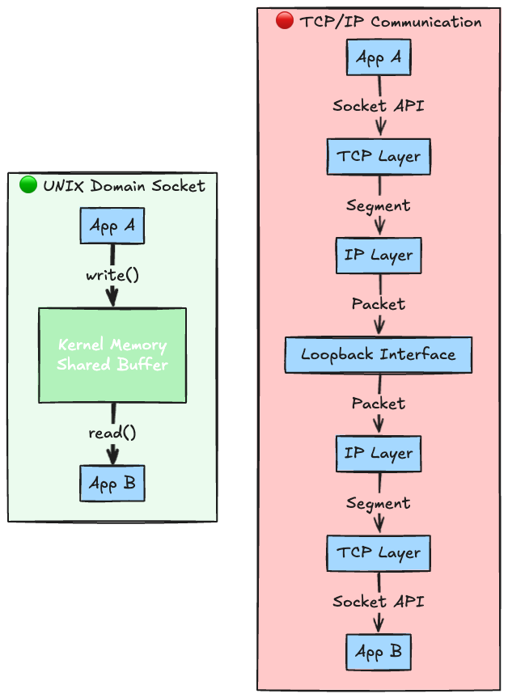
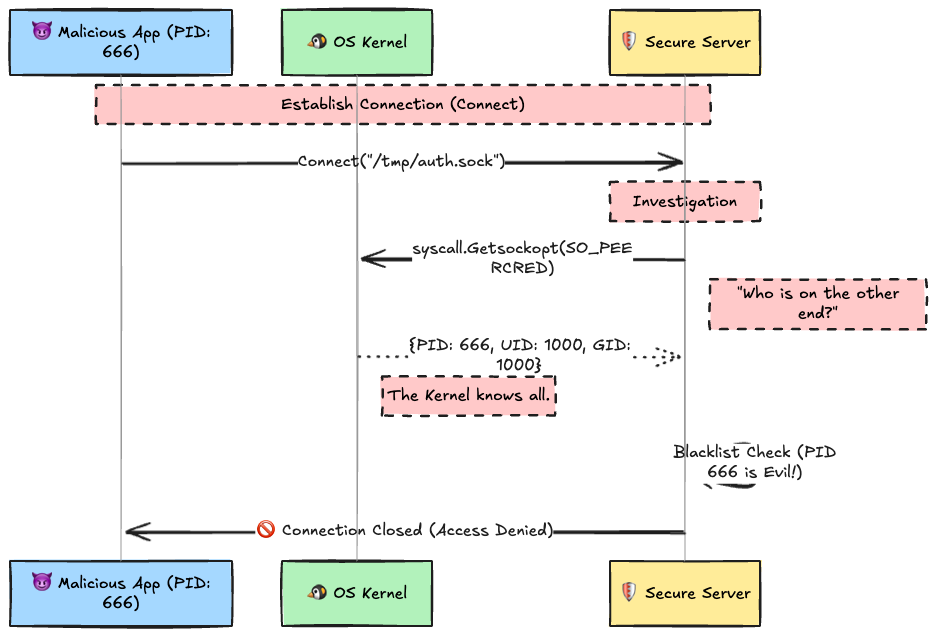
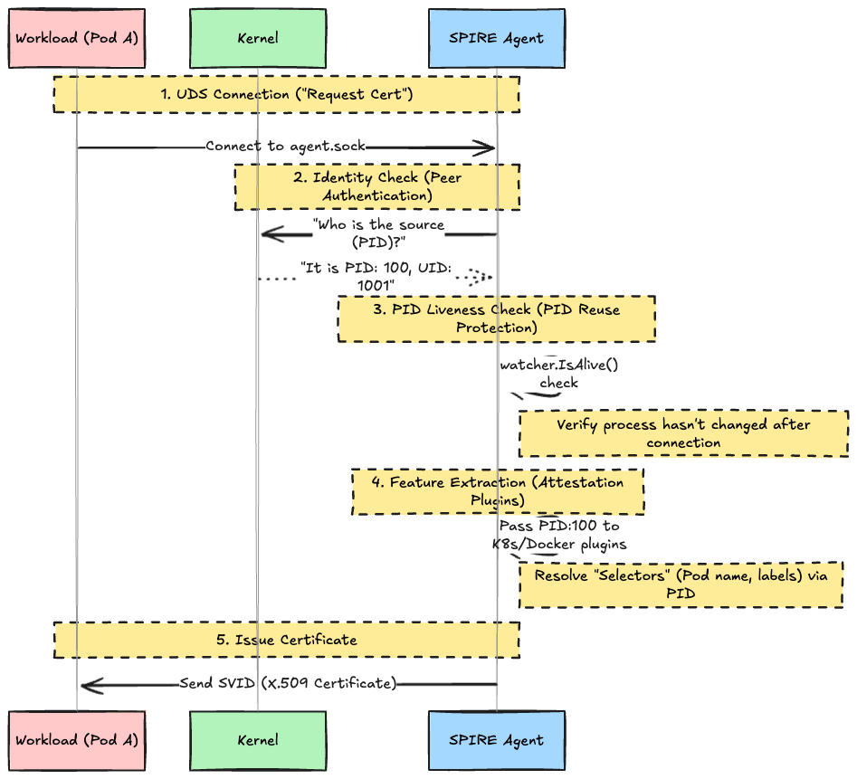

# Introduction

`/var/run/docker.sock` for controlling Docker. `agent.sock` for SPIRE to authenticate workloads.
Why do these tools, which underpin modern infrastructure, adopt the seemingly archaic "UNIX Domain Socket (UDS)" as their standard interface instead of TCP/IP?

It is not merely because "it is fast." There is a decisive security reason: **absolute identity assurance provided by the OS kernel.**

In this article, we will step through the true nature of sockets, the critical differences from TCP, and conduct an experiment using Go to actually extract the "identity of the connection peer (PID/UID)" from the kernel.

---

## 1. The True Nature of ".sock": A File, Yet Not a File

Many people are taught that "sockets are handled as files." When you look at them with `ls -l`, they certainly exist as files.

```bash
srw-rw---- 1 root docker 0 Jan 1 12:00 /var/run/docker.sock

```

However, the file size is always `0`. This is because its substance is not data on a disk, but merely an address book entry for a **communication endpoint (window) in kernel memory**.

### How Does Data Flow?

Comparing the data flow of TCP/IP and UDS makes the difference in efficiency immediately apparent.



* **TCP**: Even for local communication, data goes through a heavy network stack involving packet encapsulation, checksum calculation, and routing table lookups.
* **UDS**: Completely bypasses the network stack, completing communication solely via buffer copying within the kernel. This results in overwhelmingly low latency.

---

## 2. Thorough Comparison: TCP vs UDS

|      Feature       |         TCP Socket (INET)         |        UNIX Domain Socket (UDS)        |
| :----------------: | :-------------------------------: | :------------------------------------: |
|   **Addressing**   |    IP:Port (`127.0.0.1:8080`)     |      File Path (`/tmp/app.sock`)       |
|     **Scope**      |       Over Network (Remote)       |       **Same Host Only (Local)**       |
|    **Overhead**    | High (Protocol Headers, Checksum) |     **Minimal (Memory Copy Only)**     |
| **Access Control** |     Firewall (iptables), TLS      |   **File Permissions (chmod/chown)**   |
|    **Identity**    |       Source IP (Spoofable)       | **PID/UID/GID (Guaranteed by Kernel)** |

---

## 3. Peer Authentication

In TCP communication, while you can see the source IP address, there is no reliable way to know "which process (who)" initiated the connection (due to risks like IP spoofing).

However, with UDS, the server can command the kernel: **"Reveal the information of the process behind this connection."** This is called **`SO_PEERCRED`**.

### Authentication Sequence



Since this information is retrieved directly from the OS kernel's internal management data, **it is impossible for the client side to spoof it**. This is the primary reason why Zero Trust systems like SPIRE adopt UDS.

## 4. Experiment: Implementing "Identity Verification" in Go

The proof is in the pudding. Let's write a server and actually expose the PID and UID of a connected client.

> **⚠️ Note**: `SO_PEERCRED` is a Linux-specific feature. It will not work on macOS or Windows.
> I have prepared execution steps using Docker so you can run this on your local environment.

### Experiment Code (`main.go`)

```go
package main

import (
    "fmt"
    "net"
    "os"
    syscall "syscall"
)

func main() {
    socketPath := "/tmp/test.sock"
    // Remove previous socket file if it exists
    os.Remove(socketPath)

    // Start UDS Server
    l, err := net.Listen("unix", socketPath)
    if err != nil {
        panic(err)
    }
    defer l.Close()

    // Change permissions so anyone can write (for experiment)
    os.Chmod(socketPath, 0777)

    fmt.Println("🕵️  Server is listening on", socketPath)
    fmt.Println("waiting for connection...")

    for {
        conn, _ := l.Accept()
        go handleConnection(conn)
    }
}

func handleConnection(c net.Conn) {
    defer c.Close()

    // 1. Get the File Descriptor (FD) of the Unix socket
    unixConn, ok := c.(*net.UnixConn)
    if !ok {
        fmt.Println("Not a unix connection")
        return
    }
    file, _ := unixConn.File()
    defer file.Close()
    fd := int(file.Fd())

    // 2. Query the kernel for peer information (SO_PEERCRED)
    ucred, err := syscall.GetsockoptUcred(fd, syscall.SOL_SOCKET, syscall.SO_PEERCRED)
    if err != nil {
        fmt.Println("Failed to get credentials:", err)
        return
    }

    // 3. Display Results
    fmt.Printf("\n[🚨 DETECTED]\n")
    fmt.Printf(" - Connected by PID : %d\n", ucred.Pid)
    fmt.Printf(" - User ID (UID)    : %d\n", ucred.Uid)
    fmt.Printf(" - Group ID (GID)   : %d\n", ucred.Gid)

    c.Write([]byte("Identity Verified. closing.\n"))
}

```

### Execution Steps (Using Docker)

Mac and Windows users can experiment with a single command.

1. **Launch Experiment Environment**

    Mount the current directory and enter a Linux container with Go installed.

    ```bash
    # Create the Go file
    # (Save the code above as main.go)

    # Start container & enter it
    docker run -it --rm -v "$PWD":/app -w /app golang:1.25 bash
    ```

2. **Run the Server**

    Run the server in the background inside the container.

    ```bash
    go run main.go &
    # -> 🕵️  Server is listening on /tmp/test.sock

    ```

3. **Connect from Client**

    Use `nc` (netcat) within the same container to connect.

    ```bash
    echo | sh -c 'echo "Client PID: $$"; exec nc -U /tmp/test.sock'
    # Client PID: 757
    ```

### Execution Results

You should see the Process ID appear in the server logs the moment the `nc` command is executed.

```text
[🚨 DETECTED]
 - Connected by PID : 757
 - User ID (UID)    : 0
 - Group ID (GID)   : 0
```

If you check with `ps -ef`, you will see that the PID indeed belongs to the `nc` command. This is "Identity Assurance by the Kernel."

## 5. Why Do Docker and SPIRE Use This?

How is this technology applied in Cloud Native environments?

### The Case of Docker

Having access rights to `docker.sock` is effectively equivalent to having **root privileges**.
The Docker daemon uses UDS file permissions (usually `rw` only for `root:docker` group) to strictly limit users who can hit the API. Achieving this level of strict control via HTTP over a network is difficult.

### The Case of SPIRE (SPIFFE Runtime Environment)

The SPIRE Agent is responsible for issuing certificates to workloads (like Pods).
When a process asks, "Please give me a certificate," SPIRE uses `SO_PEERCRED` to verify: **Is this really the process of that Pod?**



SPIRE does not simply get the PID; it also calls **`watcher.IsAlive()`** to prevent "PID Reuse Attacks," where a process terminates after establishing a connection and the PID is reassigned to a different process.

Furthermore, the obtained PID is passed to various **Workload Attestor plugins** (such as Docker or Kubernetes). These plugins use the PID as a hook to convert it into detailed attributes (Selectors) like Container IDs or Kubernetes Pod labels.

Note that SPIRE on Windows uses **Named Pipes** instead of UDS, utilizing a similar implementation where the identity of the client is verified via the kernel. Although the OS differs, the design philosophy of "making the kernel guarantee identity" remains the same.

## Conclusion

`.sock` (Unix Domain Socket) is not just an "old technology."

1. **Overwhelming Performance**: Bypassing the network stack.
2. **Strongest Security**: ID assurance at the kernel level (Peer Cred).
3. **Simple Access Control**: Utilization of file system permissions.

Combining these features, UDS continues to be a critical component supporting the **"last one mile of host communication"** in modern container infrastructure where Zero Trust security is required.
