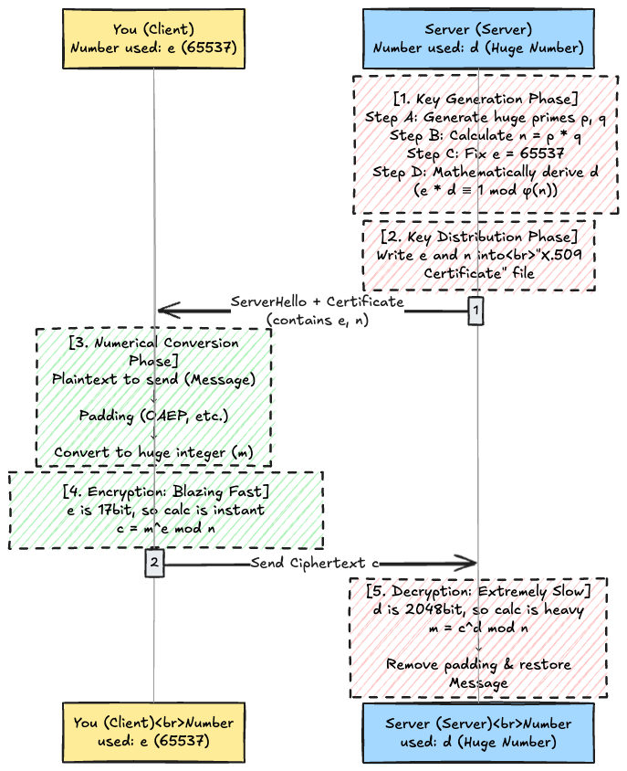
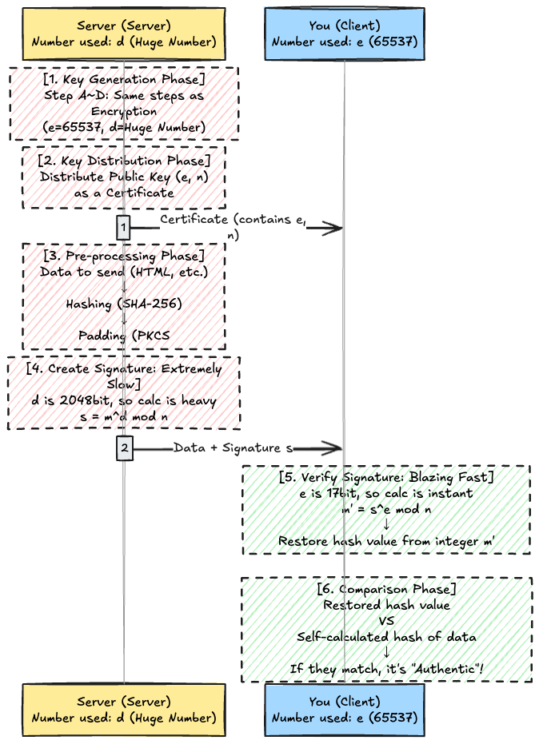

# Introduction

It is a well-known fact that "RSA's security depends on the difficulty of prime factorization," but in actual computer calculations (signing and verifying), what the CPU is sweating over is **"Modular Exponentiation."**

That is, the following calculation:


$$
x^y \pmod n
$$


Actually, depending on how parameters are chosen, this calculation can be a "process that finishes in an instant" or a "heavy process that eats up CPU resources."

In this article, I will explain the behavior of the **"Binary Method"** (the internal algorithm of RSA) and why the migration from RSA to ECDSA (Elliptic Curve Cryptography) is progressing due to server load issues, including technical details.

## 0. The Big Picture: Who Uses Which Number?

Before diving into the algorithm details, let's confirm the flow of "Encryption" and "Signing," and the numbers ($e$ and $d$) used by the actors.
The key point here is that **the "person who created the keys (the owner of the key pair)" decides the numbers.**

### Case A: Encrypted Communication (Delivering Secrets)

Here is a detailed sequence that answers the following three questions:

1. **How is $d$ determined?** $\rightarrow$ Calculated via the Extended Euclidean Algorithm.
2. **How are keys distributed?** $\rightarrow$ Written in an X.509 certificate and sent.
3. **How is text calculated?** $\rightarrow$ Padded and converted into a huge integer.

* **You (Client)**: Use the $e$ ($65537$) decided by the server $\rightarrow$ **Calculation is Fast**
* **Server**: Uses the $d$ (Huge) decided by itself $\rightarrow$ **Calculation is Slow**

#### Technical Supplement

**1. How is $d$ (Private Key) calculated?**
$d$ is not just a random number. It is mathematically determined as the unique **"number that becomes 1 when multiplied by $e$ and divided (Modular Multiplicative Inverse)."**
Specifically, it is found using an algorithm called the **Extended Euclidean Algorithm**.

$$
e \cdot d \equiv 1 \pmod{(p-1)(q-1)}
$$

Only the server, which knows $p$ and $q$ (prime factors), can solve this equation and derive $d$.

**2. How is the public key $(e, n)$ distributed?**
In the web world, raw numbers are not sent abruptly. They are sent stored inside a file format called a **"Digital Certificate (X.509)."**
The browser parses the content of the certificate sent from the server (ASN.1 decoding) and extracts $n$ and $e$ from the "Pub Key" field.

    Certificate:
        Data:
            Subject Public Key Info:            <--- This is the public key info!
                Public Key Algorithm: rsaEncryption
                    RSA Public-Key: (2048 bit)
                    Modulus:                    <--- This is n (Huge number)
                        00:c3:a7:1f: ... (snip) ... :4d:
                    Exponent: 65537 (0x10001)   <--- This is e (Small number)

**3. What does "turn the message into a binary number" mean?**
It doesn't just mean turning it into `0101...`. In RSA, to prevent the property where "the same plaintext always yields the same ciphertext," a process called **"Padding"** is essential, which stuffs random data (nonce) into the gaps of the plaintext.

* **Padding**: Stuffing random numbers before and after the message (Standards like PKCS#1 v1.5 or OAEP).
* **Integer Conversion**: Interpreting the padded byte sequence (e.g., 256 bytes) directly as **"a single huge integer."**

The calculation $m^e$ is performed on this huge integer $m$ created in this way.

---

### Case B: Digital Signature (Verifying Authenticity)

This is the pattern where the "Signer (Server)" creates keys and generates evidence with heavy calculation, and the "Verifier (You)" confirms it.
Here, we clarify the internal processes: "Why hash it?" and "What is being compared in verification?"

* **Server**: Uses the $d$ (Huge) decided by itself $\rightarrow$ **Calculation is Slow**
* **You (Client)**: Use the $e$ ($65537$) decided by the server $\rightarrow$ **Calculation is Fast**

#### Technical Supplement

**1. Why "Hash" instead of signing data directly?**

Since there is a limit to the data size RSA can calculate (the bit length of $n$, e.g., 256 bytes), huge files (like images or long HTML) cannot be thrown directly into the calculation formula $m^d$.
Therefore, data of any length is passed through a **"Hash Function"** to shrink it to a fixed length (e.g., 32 bytes for SHA-256) before signing.

**2. What is the signature padding (PKCS#1 v1.5) doing?**

It doesn't just insert the hash value; it attaches an identifier (metadata) saying "I used SHA-256" to format it properly.
The verifier side looks at the recovered data, determines "Oh, this is a SHA-256 hash," and performs confirmation using the same calculation method.

**3. What is the essence of Verification?**

When the verification formula $s^e \pmod n$ is executed, the **"Hash value padded by the signer"** pops out as the calculation result.
This is compared with the **"Hash value calculated from the data received by yourself,"** and if even 1 bit differs, it is judged as "tampering" or "spoofing," resulting in an error.

---

## 1. What is the Binary Method?

When a computer calculates a huge exponent like $x^{100}$, it does not naively repeat multiplication 99 times. It uses an algorithm called the **Binary Method (Square-and-Multiply)** to drastically reduce the computational complexity.

The rules of the algorithm are simple. Convert the exponent ($y$) to a "binary number" and perform the following operations starting from the most significant bit:

1. **If the bit is 0**:
    **Square** the current value.
2. **If the bit is 1**:
    **Square** the current value, and then **Multiply by the base (original number)**.

### The Point of Computational Complexity

The important thing is that **"the cost of multiplication is added only when the bit is 1."** In other words, the calculation speed changes depending on the bit pattern (Hamming weight) of the exponent.

### Implementation Image

You can see how it "divides every time it loops" instead of "calculating a huge number and then dividing." This allows the calculation to proceed without overflowing.

    // Golang
    func modularExponentiation(base, exponent, modulus int) int {
        result := 1

        // Loop for the number of bits in the exponent
        for exponent > 0 {
            // 1. If bit is 1, multiply and immediately mod
            if exponent%2 == 1 {
                result = (result * base) % modulus
            }

            // 2. Square for the next bit and immediately mod
            base = (base * base) % modulus

            // Move to the next bit
            exponent /= 2
        }
        return result
    }

## 2. Why Verification is "Blazing Fast" (The Magic of $e$)

In RSA verification processing (or public key encryption), the following calculation is performed:

$$
\text{Verification} \equiv s^e \pmod n
$$

The public exponent $e$ used here is a **value that humans can arbitrarily set** as long as it meets security requirements. Therefore, **$65537$** is conventionally chosen to minimize the calculation cost in the Binary Method.

When this is expressed in binary, the "intention" becomes clearly visible.

$$
65537_{10} = 10000000000000001_2
$$

* **Bit length**: 17 bits
* **Number of 1s (Hamming Weight)**: Only 2 (Just the beginning and end)

### Steps in Binary Method

The Binary Method follows the rule: **"Every time you multiply, divide by $n$ to keep it small."**

1. **Start**: $s$
2. **0 continues for 15 times**: Do "**Square** and divide by $n$" 16 times.
3. **Last is 1**: Square, and finally **Multiply** by $s$ once, and divide by $n$.

It completes in just about **17 operations**. This is why RSA verification (and encryption with a public key) is "blazing fast."

65537 is a number with a "miraculous balance" that satisfies all three of the following conditions:

1. **Fast in Binary Method** (Few 1s: `10...01`)
2. **Is a Prime Number** (Mathematically easy to use: Fermat Prime $F_4$)
3. **Sufficiently Large** (Prevents attacks on numbers that are too small)

## 3. Why Signing is "Extremely Slow" (The Constraint of $d$)

On the other hand, the calculation for signature creation (or private key decryption) is as follows:

$$
\text{Signature} \equiv m^d \pmod n
$$

This private exponent $d$ cannot be decided arbitrarily by humans. It is automatically determined mathematically as it must satisfy the following congruence:

$$
e \cdot d \equiv 1 \pmod{\phi(n)}
$$
*(Here $\phi(n)$ is Euler's totient function)*

For security reasons, relative to the modulus $n$ (e.g., 2048 bits), $d$ will be of a similar bit length, and its bit pattern will be close to random.

$$
d \approx 1101011...(\text{snip})...00110_2
$$

* **Bit length**: Approx. 2048 bits (In the case of RSA-2048)
* **Number of 1s**: Averages to about half the bit length, meaning **approx. 1024**

### Steps in Binary Method
1.  **Square**: Occurs for the number of digits, so approx. **2048 times**.
2.  **Multiply**: Occurs every time a bit is 1, so approx. **1024 times**.

**Conclusion**: A total of **over 3000 operations** are required. Compared to the 17 times for verification, there is a difference of hundreds of times in computational complexity.

---

## 4. Why Not Make $d$ an "Easy-to-Calculate Value" Too?

Here, a natural question arises: "If we adjust $e$ so that $d$ also becomes a simple number (a number with small Hamming weight) like $65537$, wouldn't signing become fast too?"

However, this invites a **fatal vulnerability** in cryptographic theory.

It has been proven that if $d$ is small, there are attack methods (**Wiener's Attack** or **Boneh-Durfee Attack**, etc.) that can efficiently recover $d$ from the public $e$ and $n$.

In other words, the fact that $d$ is a huge, complex number is the very foundation of RSA's security: **"Unless $n$ can be factorized, $d$ can absolutely not be guessed."**

## 5. "Server's Suffering" in TLS

This asymmetric performance characteristic imposes a heavy burden on the server side in TLS (SSL) communication.

### RSA Key Exchange (Pre-TLS 1.2)
* **Client**: $m^e$ (Encrypt) $\rightarrow$ **Blazing Fast**
* **Server**: $c^d$ (Decrypt) $\rightarrow$ **Extremely Slow**

### Authentication by Signature (TLS 1.3 / Modern Web)
* **Server**: $m^d$ (Create Signature) $\rightarrow$ **Extremely Slow**
* **Client**: $s^e$ (Verify Signature) $\rightarrow$ **Blazing Fast**

Ultimately, when establishing encrypted communication, the server is always forced to perform "calculations using the private key $d$."
In the modern web, where "one server handles tens of thousands of clients," this CPU load cannot be ignored. This is one of the main reasons why **ECDSA (Elliptic Curve Cryptography)**, which has a lighter load on the server, is preferred.
*(※ ECDSA verification is slower than RSA, but signature creation is much faster than RSA)*

---

## Conclusion: Roles and Held Data by Actor

Finally, let's summarize "Who holds what" and "What calculations they perform."

### Signer (Server, Creator)

* **Role**: To prove "I am the principal."
* **Held Values**:
  * $m$: Hash value of the message
  * $d$: **Private Exponent** (Huge number, absolutely secret)
  * $n$: Modulus
* **Calculation**: $$s = m^d \pmod n$$
* **Feature**: The Binary Method loops many times, making the calculation cost very high.

### Verifier (Client, Browser)

* **Role**: To confirm "Is the signature authentic?" and "Has it been tampered with?"
* **Held Values**:
  * $s$: Received signature
  * $m$: Hash value calculated from the message by oneself
  * $e$: **Public Exponent** (Usually $65537$)
  * $n$: Modulus (Listed in certificate)
* **Calculation**: $$\text{Check} = s^e \pmod n$$
* **Judgment**: If the calculation result matches the local $m$, it passes.
* **Feature**: Since there are few "1"s in the bits of $e$, the calculation finishes in an instant.
