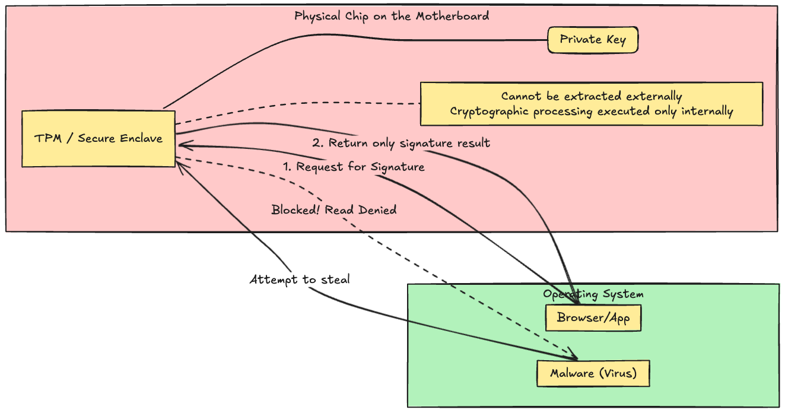
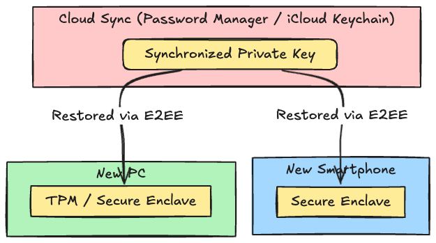
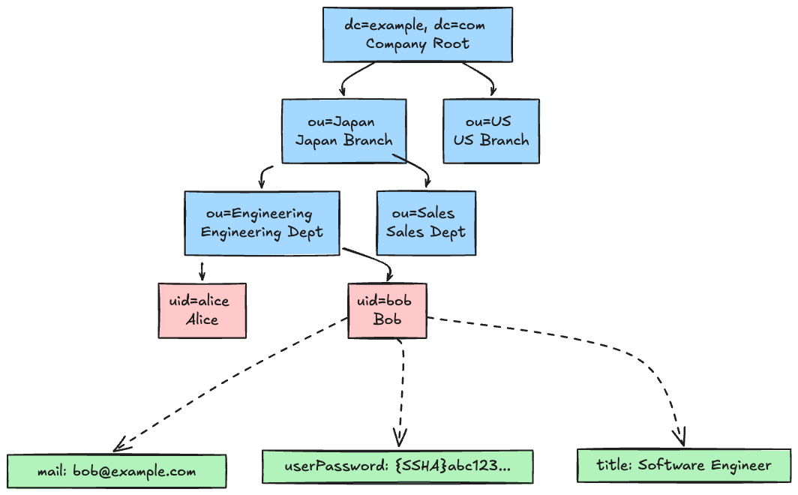
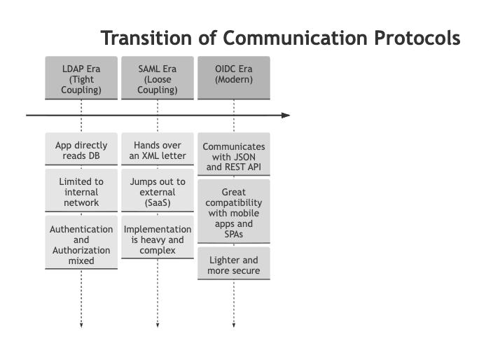
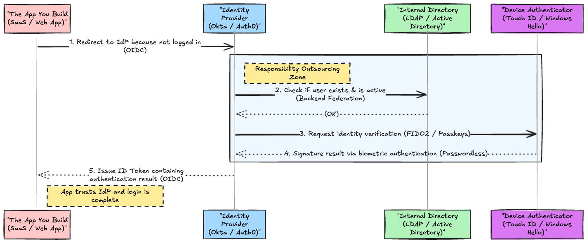

# Introduction

Recently, while reading protocol specifications (RFCs) like OAuth 2.0 or OpenID Connect (OIDC), have you ever stumbled upon a fundamental question?

> "By the way, what exactly is happening behind the scenes during 'Authentication'?"

We normally click the "Login" button and access SaaS or internal systems without a second thought. However, behind the scenes, an epic technical relay is taking place—starting from the user's fingertips (physical device), diving deep into the enterprise directory (database), and flying between applications as tokens.

In this article, we won't just explain protocols. We will unravel the entire picture in 4 steps, from **"how to verify the identity of the person (the starting point)"** to **"how to convey that result to the system (the federation)"**.

By reading from top to bottom, the long-standing haze of "why are these technologies being used now?" should completely clear up.

---

## 1. The Authentication Revolution

"How do we confirm that the person on the other side of the screen is actually 'them'?"
Everything starts here. This is the story of the physical technologies that serve as the starting point.

### 1-1. Goodbye Passwords, Hello Public Keys (FIDO2 / WebAuthn)

For many years, internet authentication has relied on the mechanism of "passwords".
However, passwords have a structural and fatal flaw. They are a **"shared secret"**.

The password entered by the user is sent over the network to the server, where it is matched against a string (or hash) stored on the server side.
In other words, you are entrusting your secret to the server. If the server is attacked, the secrets are leaked all at once.

This issue was fundamentally resolved by the authentication paradigm introduced by **FIDO2 (WebAuthn)**, which utilizes "public key cryptography".

**Key Points of the Paradigm Shift:**

- **Passwords leak because they are transmitted.**
- In FIDO2, only the "Public Key" generated inside the device is registered with the server. The "Private Key" never leaves the device.
- During login, you simply take the prompt (challenge) sent by the server and return it after "signing" it with the private key at hand.
- Because of this, the server is no longer a "strict safe that holds secrets". Its role has been downgraded to a mere **"phonebook with a list of public keys"**. Even if the phonebook is leaked, the public key alone cannot be used to log in, making it harmless.

### 1-2. The Hiding Place of Secrets (TPM / Secure Enclave)

With FIDO2, the risk of secrets being stolen over the network has been eliminated.
However, a new problem emerges: "How do we protect the 'Private Key' that remains inside the device from malware or physical theft?"

If the private key were stored as a normal file on an HDD or SSD, a virus could easily copy it.

This is where special hardware chips called **TPM (Trusted Platform Module)** or **Secure Enclave** come into play.

**Hardware Defense Wall:**

- The private key is generated and stored inside this "unopenable safe (TPM)" welded to the motherboard.
- The terrifying thing about this chip is that **even the OS or Administrator/root privileges cannot directly read the private key inside.**
- From the outside, you can only ask the chip to "sign this data." Only when passing biometric authentication (fingerprint or face) is the signature executed **internally** within the chip, and only the result is returned.

Because of this, no matter how powerful the malware you are infected with is, dragging out the private key itself is physically impossible by design.

### 1-3. The Triumph of Usability (Passkeys)

With the combination of TPM and FIDO2, technically, an "unbreakable strong authentication" was completed. Physical security keys like YubiKey are prime examples.

However, history always hits the same wall. **"Something too secure is hard for humans to use."**
The strictness of the TPM's rule to "never let the private key out" created a tragedy where the moment a user dropped their smartphone in the ocean, they could never log into their accounts again. Forcing general users to re-register keys on dozens of sites every time they change their device is unbearable.

Here, the compromise and breakthrough devised by Apple, Google, and Microsoft is **"Passkeys"**.

**The Fusion of Security and Convenience:**

- Passkeys are basically FIDO2-based technology, but with a rule change stating: "It is acceptable to safely sync (backup) the private key to the cloud (e.g., iCloud Keychain)."
- Of course, it isn't synced in plaintext. Through End-to-End Encryption (E2EE), it is synced in a state where even the platformer cannot see the contents.
- Because of this approach, they achieved ultimate usability: "Even if you buy a new smartphone, by simply logging in with the same Apple ID/Google account, you can log into sites using fingerprint authentication right from the start." This caused FIDO technology to suddenly spread to the general public.

---

## 2. The Truth about Infrastructure

Up to this point, we've talked about the front-end and the device side: "how to verify the identity of the user."
From here on, let's change our perspective and talk about the back-end. "Where exactly is the information of the authenticated user stored?"

### 2-1. The Identity of the Giant (LDAP & Active Directory)

The heart that centrally manages the account information of all employees within a company or organization. That is **LDAP (Lightweight Directory Access Protocol)**, and its most famous representative is Microsoft's **Active Directory (AD)**.

A common misunderstanding is: "LDAP is an old authentication method, so it's been replaced by SAML and OIDC now, right?" This is half correct and half wrong.

**The Truth: LDAP is a protocol, and at the same time, it is a high-speed database that represents the "hierarchical structure (tree)" of an organization itself.**

- While an RDBMS (like MySQL or PostgreSQL) manages data using "tables", LDAP manages it in the form of a "directory (tree structure)".
- In the "Leaf Node" at the end of this tree structure, for example, the node (entry) `uid=bob`, **"Attributes" such as email address, job title, and password (hashed `userPassword` attribute) are stored hanging off it.**
- When a department transfer occurs, you only need to move the base of this branch to another department (or change the affiliation group in the hierarchy). It is extremely suitable because the "organization chart" of the human world perfectly matches the data structure.
- Furthermore, because it is extremely optimized for "reading (searching)" rather than writing, it can handle thousands of inquiries (Bind operations) per minute at ultra-high speed, such as "Does the user with this DN (Distinguished Name) exist? Is the password (or key information) correct?"

Although it has become rare for modern applications on the main stage to speak the LDAP protocol directly, LDAP as a data repository (data store) still proudly reigns as the "Source of Truth" for companies worldwide.

---

## 3. The Evolution of Federation

Suppose identity verification is done on the device, and it is confirmed that the data exists in LDAP.
So, how do "various applications inside the company" or "external SaaS (like Salesforce or Slack)" learn about this information?

### 3-1. The Transition of the Common Language (LDAP -> SAML -> OIDC)

The "language (protocol)" used by applications to talk to the authentication infrastructure (directory) has evolved with the times. Rather than "old technology being driven out," it is more accurate to say that "because the conversation partner and location changed, the language had to change".

What is important here is the question: **"If LDAP continues to be used as the internal database, then not everything has been replaced by OIDC, right?"**
That is exactly correct. Modern systems **use different protocols for "internal communication" and "external communication"**.

1. **LDAP Protocol Era (Complete Tight Coupling)**
   In the past, when an internal system received an ID/password entered by a user, the app itself directly connected to the LDAP server through the internal network and directly asked, "Is this password correct?". However, in the cloud era, letting external SaaS directly peek into the internal LDAP became a security impossibility.
2. **SAML Era (The Beginning of External Loose Coupling)**
   Therefore, the application and LDAP were separated. The mechanism became: "When the authentication infrastructure (IdP) verifies the user's identity by consulting LDAP behind the scenes, it passes a certificate (an XML letter) saying 'this person is definitely employee Alice' to the external SaaS via the browser." This made login (SSO) possible without passing the password itself to the SaaS. However, SAML (XML) was too heavy to handle from smartphones and the like.
3. **OIDC Era (The Modern De Facto Standard)**
   Inheriting the concept of SAML but expanded based on OAuth 2.0, allowing communication via modern web standards "JSON and REST API", is OpenID Connect (OIDC). It is lightweight, pairs perfectly with SPAs and mobile apps, and is the current de facto standard for the front door (external communication) of SSO.

**The Realistic Truth of Hybrid Architectures**

What is interesting here is that **"So, did SAML and LDAP die in the OIDC era?", the answer is: they are not dead at all.**
For example, imagine a case where an "external SaaS (like Okta)" is used as the frontend IdP, and the "old internal Active Directory" is used as the directory.

Communication between the app and Okta happens crisply with **modern OIDC**.
However, communication between Okta and the internal Active Directory takes place via **legacy LDAP** or dedicated connector agents. Or, to connect old on-premises systems, crazy techniques like **embedding a SAML Assertion within OIDC for communication (RFC 7522: SAML 2.0 Bearer Assertion Profile)** are actually used in reality.

In other words, while the "front-facing appearance seen by users and apps" has evolved into the modern and clean JSON protocol of OIDC, the dirty technologies of LDAP and SAML still strongly pulse through the "veins behind the scenes". This is the reality of modern enterprise architecture.

---

## 4. Architecture

Let's piece together what we've seen so far.
In modern systems, how are these orchestrated?

### 4-1. The Intermediary That Connects Everything (IdP)

The frontend revolution (FIDO2/Passkeys), the immutable power of the backend (LDAP), and modern communication standards (OIDC). The massive intermediary that binds all these together and functions as a control panel is the **IdP (Identity Provider)**. (Examples: Okta, Entra ID, Auth0, etc.)

The existence value of an IdP can be summed up in one phrase: **"Complete outsourcing of authentication responsibilities."**

1. **The Culmination of Part 1**: The IdP, via the browser, requests the user's device (TPM) for a secure signature using FIDO2/Passkeys. The dirty work of encrypted communication is swallowed up by the IdP.
2. **The Culmination of Part 2**: The backend of the IdP is connected with a thick pipe to the enterprise's LDAP/AD. If a retired employee is deleted from LDAP, the IdP detects it immediately and blocks access.
3. **The Culmination of Part 3**: After all these checks are completed, the IdP packs the result saying "this person is definitely authenticated and has valid permissions" into a beautiful JSON token (ID Token) of OIDC, and delivers it to the final destination application.

Developers no longer need to rack their brains over "password hashing logic", "biometric authentication implementation", or "creating LDAP connectors".
**"Leave it entirely to the IdP using OIDC"**. With just that, you can rapidly build applications that provide users with the highest convenience (Passkeys) while incorporating robust security rooted in corporate culture (AD Federation).

### Conclusion

The mechanism of authentication seems extremely complex at first glance, but if you break down the elements, you find that each technology is "an inevitable puzzle piece born to compensate for past weaknesses".

- To eliminate **leaking passwords**, **Public Key Cryptography (FIDO2)** was born.
- To prevent **keys from being stolen**, they were placed in a **hardware safe (TPM)**.
- So as not to spoil **convenience**, **Cloud Sync (Passkeys)** was permitted.
- To efficiently lookup the **corporate directory**, **LDAP** continues to live behind the scenes.
- To talk safely and lightly with **external SaaS**, the modern language of **OIDC** became established.
- And the conductor guiding all of these is the **IdP**.

"Why is FIDO never mentioned in OAuth or OIDC articles?" "Why are SAML and LDAP not discussed side-by-side?" — That is because they each perform completely different "separate jobs" at entirely different levels within the massive pyramid of authentication.

By keeping this entire picture (map) in your brain, the resolution with which you read official RFCs and specifications will be completely different from before.
