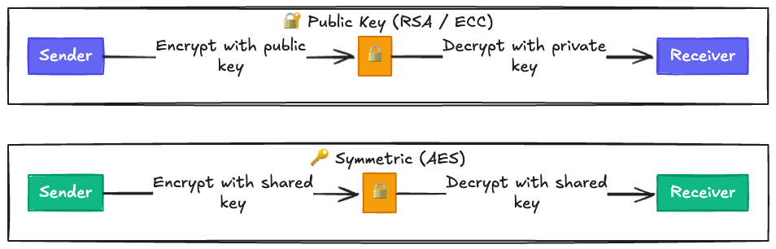
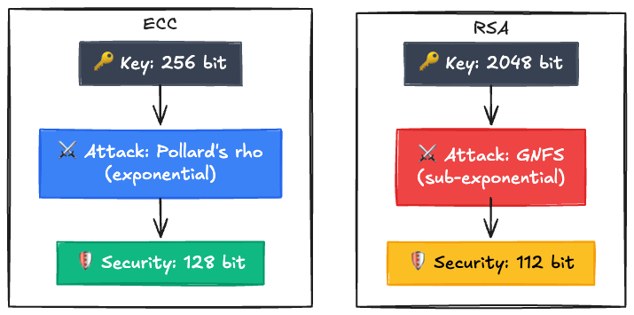
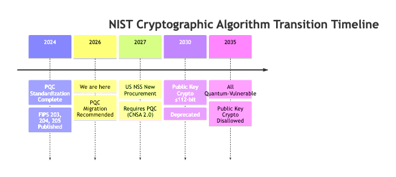
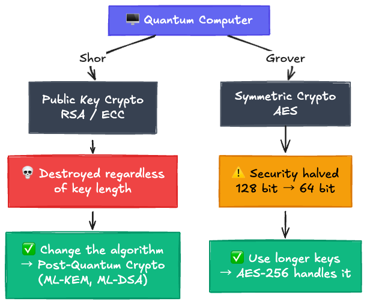
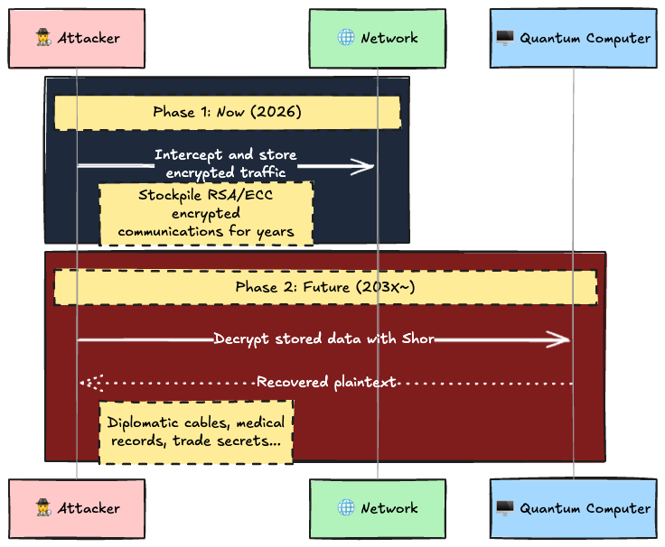

"ECDSA P-256 has shorter keys than RSA-2048. So it must be weaker."

...I used to think that too.

2048 bits vs 256 bits. Just looking at the numbers, RSA seems 8x "stronger." But NIST (the National Institute of Standards and Technology) treats these two as **equal in security strength**.

On top of that, RSA-2048's actual security does not even reach "128-bit security." It sits at **112 bits**, and it is getting deprecated in 2030. Meanwhile, P-256 properly achieves 128-bit security.

So **the shorter key is actually stronger**. The concept behind this counterintuitive fact is called "security bits."

This article covers why "key length" and "actual security" do not match up, from the mathematical foundations all the way to the 2026 transition timeline.

---

## 1. Background: Symmetric vs Public Key Cryptography

There are two fundamental types of cryptography. Without understanding this distinction, key length discussions will never make sense.

**Symmetric Key Cryptography**: Uses **the same key** for both encryption and decryption. The canonical example is **AES** (Advanced Encryption Standard). Both sender and receiver need to share the same key. It is fast, and it is what actually encrypts your data. WiFi (WPA2/3) and disk encryption (BitLocker, FileVault) all use this.

**Public Key Cryptography**: Uses **a pair of different keys** for encryption and decryption. The main examples are **RSA** and **ECC** (Elliptic Curve Cryptography). You can hand out the public key to anyone, but only the corresponding private key can decrypt. Key distribution is easy, so it is used for TLS (HTTPS) key exchange and digital signatures. The downside is that it is computationally expensive.



In practice, HTTPS combines both. Public key crypto handles "securely exchanging a key," then symmetric crypto handles "encrypting data fast."

Now here is the thing. **These two types of cryptography require completely different key lengths.**

---

## 2. "Key Length" and "Security Bits" Are Different Things

Let me clarify the terminology.

- **Key Length**: The number of bits in the key data that the algorithm uses. RSA-2048 uses 2048 bits, AES-128 uses 128 bits.
- **Security Bits (Security Strength)**: The computational effort required to break the cipher, expressed as a power of 2.

"128-bit security" means that even the best known attack requires roughly $2^{128}$ operations. $2^{128}$ is about 3.4 x $10^{38}$. Even if you threw every supercomputer on Earth at it, you could repeat the entire age of the universe (about 13.8 billion years) trillions of times over and still not finish. It is basically the threshold for "cannot be broken in practice."

Here is the biggest source of confusion: **key length ≠ security bits**.

AES-128 has 128-bit security. Key length and security bits happen to match.
But RSA-2048 only has 112-bit security. Despite having a 2048-bit key, its effective strength is only 112 bits.

Why does this happen?

---

## 3. Each Cipher Has Different Attack "Shortcuts"

Breaking a cipher is not just about trying every possible key (brute force). Some algorithms have much more efficient attack methods. The existence and efficiency of these "shortcuts" determine the key length each algorithm needs.

### AES: No shortcuts, so key length = security bits

The best known attack against AES is essentially brute force. For AES-128, you need to try all $2^{128}$ possible keys. That is why key length directly equals security bits.

### RSA: Integer factorization is a powerful shortcut

RSA's security relies on the assumption that "factoring a huge number $N$ is hard."

$N$ is the product of two large primes $p$ and $q$ ($N = p \times q$). If you can find $p$ and $q$, you can compute the private key, but if $N$ is large enough, factoring should take an impractical amount of time... or so the idea goes.

The problem is that there exists an efficient algorithm for integer factorization called the **General Number Field Sieve (GNFS)**. Thanks to GNFS, the effort to break RSA-2048 drops from $2^{2048}$ (brute force) down to roughly $2^{112}$.

Think of it this way. If you tried every combination on a 2048-digit safe one by one, it would take an astronomical amount of time. But GNFS is like "analyzing the safe's internal structure to dramatically narrow down the combinations." The key is 2048 bits, but the effective defense is only 112 bits.

### ECC: Has shortcuts, but they are far less efficient than RSA's

ECC (Elliptic Curve Cryptography) relies on the "Elliptic Curve Discrete Logarithm Problem (ECDLP)."

I will skip the detailed math, but the key point is this: the best attack against ECC (Pollard's rho) requires computation proportional to **half the key length**. For P-256 (256-bit key), that means $2^{128}$ operations, which gives you 128-bit security.

Digging a bit deeper, this difference comes from a **gap in computational complexity**. GNFS runs in **sub-exponential time**, meaning that even as you make keys longer, the attack cost grows sluggishly. Pollard's rho against ECC, on the other hand, runs in **exponential time**, specifically $O(\sqrt{N})$. Each extra bit in the key doubles the attack cost.

In concrete numbers: RSA-2048 goes from 2048 bits to 112-bit security (roughly 1/18), RSA-3072 goes from 3072 bits to 128 bits (roughly 1/24), and RSA-15360 goes from 15360 bits to 256 bits (roughly 1/60). The longer the key, the worse the "decay ratio" gets. This is a direct consequence of GNFS being sub-exponential: the growth in attack cost cannot keep up with the cost of making keys longer. ECC stays at 1/2 regardless. This mathematical gap is what makes "ECC is secure with short keys" possible.



RSA has the longer key but the lower security bits. That is how big the difference in attack efficiency is.

---

## 4. Equivalent Security Key Lengths (NIST SP 800-57)

So how do these differences in attack efficiency translate to actual key lengths? NIST SP 800-57 Part 1 defines a security strength equivalence table, and it is the industry standard as of 2026.

| Security<br/>Bits | Symmetric<br/>(AES) | RSA<br/>(Key) | ECC<br/>(Key) | Hash<br/>(SHA) | Status                 |
| :---------------: | :-----------------: | :-----------: | :-----------: | :------------: | :--------------------- |
|      **80**       |          -          |     1024      |      160      |     SHA-1      | ❌ Prohibited           |
|      **112**      |          -          |     2048      |      224      |    SHA-224     | ⚠️ Deprecated by 2030   |
|      **128**      |       AES-128       |     3072      |      256      |    SHA-256     | ✅ Current minimum      |
|      **192**      |       AES-192       |     7680      |      384      |    SHA-384     | ✅ Recommended          |
|      **256**      |       AES-256       |     15360     |     512+      |    SHA-512     | ✅ Long-term protection |

Read this table horizontally. **Every entry in the same row provides the same security.**

Look at the 128-bit security row: AES needs 128 bits, ECC needs 256 bits, and RSA needs **3072 bits**. RSA requires 12x the key length of ECC and 24x that of AES for the same security level. At 192-bit security, RSA-7680 is needed, and that causes serious performance issues in TLS handshakes.

The most important row right now is 112 bits. That is where RSA-2048 lives. It does not meet the current minimum recommendation of 128-bit security.

---

## 5. RSA-2048 Gets Deprecated in 2030

By now you know that RSA-2048 only provides 112-bit security. But it is not getting disabled overnight. NIST has defined a phased transition schedule.

### NIST Transition Timeline

NIST IR 8547 (published November 2024) lays out the concrete timeline.



| When     | Status         | Scope                                                                             | What it means                                               |
| :------- | :------------- | :-------------------------------------------------------------------------------- | :---------------------------------------------------------- |
| **2030** | **Deprecated** | RSA-2048 and other ≤112-bit algorithms                                            | No new deployments. Existing systems need a migration plan. |
| **2035** | **Disallowed** | RSA-3072/4096, P-256, P-384, and<br/>**all** quantum-vulnerable public key crypto | Completely prohibited in FIPS-compliant systems.            |

Take a close look at the 2035 row. RSA-3072, P-256, P-384: algorithms that are currently "recommended" will all be prohibited. This is not about security bits. It is about quantum computers breaking the algorithms at a fundamental level. The next section explains why making keys longer will not help.

### The Gap Between 112 and 128 Bits Is Not "Just 16"

You might think "112 vs 128, that is only 16 apart." But in security bits, the difference is exponential.

$2^{128} \div 2^{112} = 2^{16} = 65,536$

An attacker capable of breaking 112-bit security would need **65,536 times** more computation to break 128-bit security. Put another way, 112-bit security is only $\frac{1}{65536}$ as hard to break as 128-bit.

RSA-2048 is not going to be cracked tomorrow, not in 2026. But computing power improves every year. If you are encrypting data today with RSA-2048 that would be damaging if decrypted in 10 or 20 years (medical records, intellectual property, diplomatic communications), it is time to start thinking about migration.

---

## 6. Quantum Computers: Why Longer Keys Will Not Save You

In section 5, I wrote that RSA-3072 and P-384 will be prohibited by 2035. If longer keys mean more security bits, why ban them?

The answer is quantum computers. Quantum computers affect cryptography in two ways, and they are fundamentally different from each other.

### Shor's Algorithm: Breaks Public Key Crypto at the Root

Shor's algorithm solves integer factorization and the discrete logarithm problem in **polynomial time**.

For RSA, this means the assumption that "factoring $N$ is astronomically hard" simply collapses. The discrete logarithm problem behind ECC falls the same way. No matter how long you make the key, the fundamental assumption the algorithm relies on is gone. Upgrade to RSA-4096, RSA-15360, it makes no difference against Shor.

This is why "all quantum-vulnerable public key crypto is prohibited by 2035." It is not a key length issue. You **have to change the algorithm itself**.

### Grover's Algorithm: Halves Symmetric Crypto Security

Grover's algorithm speeds up brute-force search from $2^n$ to $\sqrt{2^n} = 2^{n/2}$.

| Symmetric Cipher | Classical Security | Quantum Security | Verdict      |
| :--------------- | :----------------: | :--------------: | :----------- |
| **AES-128**      |      128 bit       |   → **64 bit**   | ❌ Not enough |
| **AES-192**      |      192 bit       |   → **96 bit**   | ⚠️ Marginal   |
| **AES-256**      |      256 bit       |  → **128 bit**   | ✅ Sufficient |

One caveat, though. These numbers assume Grover's algorithm running under ideal conditions. Actually attacking AES-128 with Grover would require tens of millions of logical qubits, which is orders of magnitude beyond current quantum computers (which have a few thousand physical qubits at best). Still, for long-term security, moving to AES-256 is the safe bet.

The crucial difference from Shor is that Grover **can be countered by using longer keys**. AES-256 maintains 128-bit security even against quantum computers. No need to change the algorithm. Just use longer keys.

This is why NIST is saying "use AES-256, use SHA-384 or above."



---

## 7. Harvest Now, Decrypt Later: Today's Data, Broken Tomorrow

"Practical quantum computers are still years away, right?"

That is the most dangerous assumption. There is an attack model called Harvest Now, Decrypt Later (HNDL).



Attackers intercept encrypted data **now** and store it, then decrypt it once quantum computers become viable. The NSA and CISA have warned that nation-state actors are already in this "collection phase."

The critical question is: how long does your data need to stay confidential? If a medical record encrypted today gets decrypted 20 years from now, that is a real data breach. Before quantum computers arrive, long-lived sensitive data needs to be re-protected with quantum-resistant methods.

---

## 8. Post-Quantum Cryptography (PQC) Key Sizes

So what cryptography can actually withstand quantum computers? In August 2024, NIST officially published three post-quantum cryptography standards.

### ML-KEM (FIPS 203): Key Encapsulation

Formerly known as CRYSTALS-Kyber. Replaces RSA key exchange and ECDH.

| Parameter       | Security       | Public Key  | Ciphertext  |
| :-------------- | :------------- | :---------: | :---------: |
| **ML-KEM-512**  | AES-128 equiv. |  800 bytes  |  768 bytes  |
| **ML-KEM-768**  | AES-192 equiv. | 1,184 bytes | 1,088 bytes |
| **ML-KEM-1024** | AES-256 equiv. | 1,568 bytes | 1,568 bytes |

### ML-DSA (FIPS 204): Digital Signatures

Formerly known as CRYSTALS-Dilithium. Replaces RSA signatures and ECDSA.

| Parameter     | Security       | Public Key  |  Signature  |
| :------------ | :------------- | :---------: | :---------: |
| **ML-DSA-44** | AES-128 equiv. | 1,312 bytes | 2,420 bytes |
| **ML-DSA-65** | AES-192 equiv. | 1,952 bytes | 3,309 bytes |
| **ML-DSA-87** | AES-256 equiv. | 2,592 bytes | 4,627 bytes |

### SLH-DSA (FIPS 205): Hash-Based Signatures

Formerly known as SPHINCS+. Positioned as a backup for ML-DSA. It relies on a different mathematical foundation (hash functions) than the lattice-based ML-DSA, so it serves as insurance in case a vulnerability is found in ML-DSA.

### Comparing Legacy Crypto and PQC Key Sizes

This is where PQC hurts. Quantum resistance comes at the cost of larger keys and signatures.

|                | ECDSA P-256 | RSA-3072  |          ML-DSA-65          |
| :------------- | :---------: | :-------: | :-------------------------: |
| **Public Key** |  64 bytes   | 384 bytes |       **1,952 bytes**       |
| **Signature**  |  64 bytes   | 384 bytes |       **3,309 bytes**       |
| **Security**   |   128 bit   |  128 bit  | 192 bit (quantum-resistant) |

ML-DSA-65's public key is **roughly 30x** that of ECDSA P-256. This directly impacts TLS handshake sizes and certificate chains. That is why hybrid approaches (combining legacy crypto + PQC) are currently recommended. The transition will be gradual, not a full switchover all at once.

---

## 9. What to Do in 2026

Theory is great. But what should you actually do?

### Start with a Crypto Inventory

Figuring out what your systems are currently using is step one.

```bash
# Check your server's TLS certificate
echo | openssl s_client -connect example.com:443 2>/dev/null \
  | openssl x509 -noout -text \
  | grep -E "Public Key Algorithm|Public-Key"

# Check your SSH keys
for key in ~/.ssh/id_*; do
  ssh-keygen -l -f "$key" 2>/dev/null
done
```

What to check:
- Are your TLS certificates using ECDSA (P-256 or above)? If they are still RSA-2048, start planning the migration.
- Are your SSH keys Ed25519? If they are still RSA-2048, regenerate them with `ssh-keygen -t ed25519`.
- Are your JWT signatures using ES256 / EdDSA? If RS256, consider switching.
- Are you using AES-256 for symmetric encryption? Migrate long-lived data from AES-128.

### Build Crypto Agility into Your Architecture

No cryptographic algorithm lasts forever. RSA and ECC both have expiration dates.

The important thing is to not hardcode algorithms. Make them configurable via config files or environment variables so that when NIST publishes new recommendations, you can switch with a config change. If you have to rewrite code and redeploy to every environment, you are looking at months of work.

Combined with shorter certificate lifetimes (SC-081v3 brings the max down to 47 days by 2029), you can automatically switch algorithms at the next renewal cycle. If you are already auto-renewing certificates with ACME, the PQC transition is a natural extension of that.

---

## Takeaways

1. **Key length and security bits are different things.** AES-128 has 128-bit security, but RSA-2048 only has 112. The efficiency of the best known attack against each algorithm determines how many key bits it actually needs.
2. **Why ECC gets away with short keys.** GNFS against RSA runs in sub-exponential time, and the security decay ratio gets worse with longer keys (roughly 1/18 for RSA-2048, roughly 1/60 for RSA-15360). Pollard's rho against ECC stays at 1/2 regardless, so short keys provide equal or better security.
3. **RSA-2048 gets deprecated in 2030.** Per NIST IR 8547. By 2035, all quantum-vulnerable public key crypto, including RSA-3072, P-256, and P-384, will be prohibited.
4. **Quantum computers are not a key length problem.** Shor's algorithm destroys RSA and ECC at the algorithmic level. Longer keys do not help. Migration to post-quantum crypto (ML-KEM, ML-DSA) is required.
5. **Grover's algorithm can be handled with longer keys.** It halves AES security, but AES-256 still maintains 128-bit security.
6. **Run a crypto inventory now.** Know what your systems are using and build in crypto agility.

---

## References

- [NIST SP 800-57 Part 1 Rev. 5: Recommendation for Key Management](https://csrc.nist.gov/publications/detail/sp/800-57-part-1/rev-5/final)
- [NIST SP 800-131A Rev. 2: Transitioning the Use of Cryptographic Algorithms and Key Lengths](https://csrc.nist.gov/publications/detail/sp/800-131a/rev-2/final)
- [NIST IR 8547: Transition to Post-Quantum Cryptography Standards](https://csrc.nist.gov/publications/detail/nistir/8547/final)
- [FIPS 203: Module-Lattice-Based Key-Encapsulation Mechanism Standard (ML-KEM)](https://csrc.nist.gov/publications/detail/fips/203/final)
- [FIPS 204: Module-Lattice-Based Digital Signature Standard (ML-DSA)](https://csrc.nist.gov/publications/detail/fips/204/final)
- [FIPS 205: Stateless Hash-Based Digital Signature Standard (SLH-DSA)](https://csrc.nist.gov/publications/detail/fips/205/final)
- [CNSA 2.0: Commercial National Security Algorithm Suite](https://media.defense.gov/2022/Sep/07/2003071834/-1/-1/0/CSA_CNSA_2.0_ALGORITHMS_.PDF)
- [NIST Post-Quantum Cryptography: Resource Center](https://csrc.nist.gov/projects/post-quantum-cryptography)
